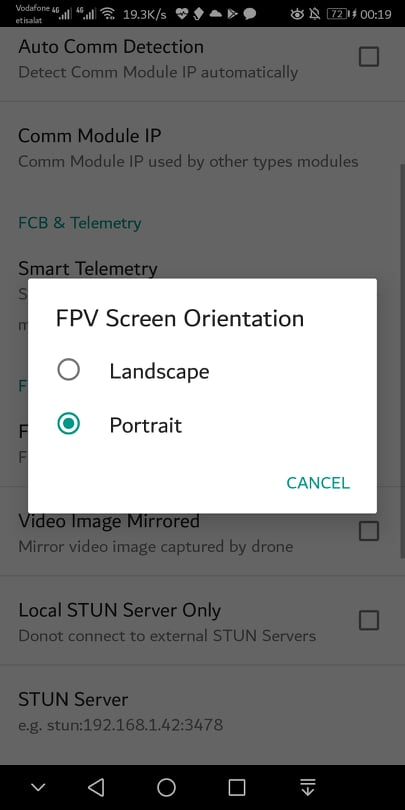
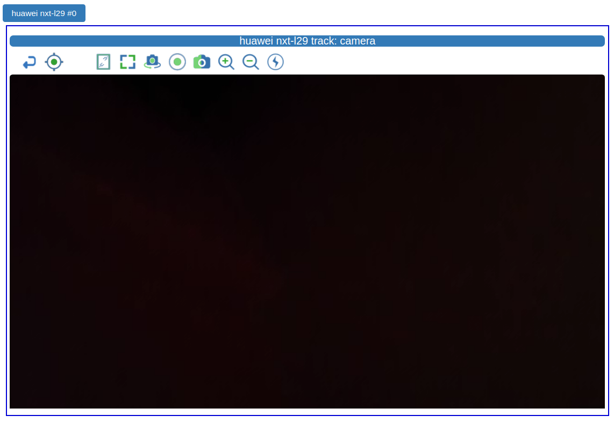

.. _andruav-fpv:

===========
Andruav FPV
===========

FPV Gears are normally expensive, requires certain setup and antennas. Andruav has a long path evolving its FPV, and has reached a very good performance using only a mobile camrea and no extra setup. You can get a real-time video under Wifi and good 3G/4G connection.

.. youtube:: PNFjHC8rWaY

|

Andruav FPV is very distinguished, as it allows multiple GCS to receive a video broadcast from the same vehicle. Those GCSs could be in different places in the world and they all share the same video streaming from drone. Also video streaming receiving is supported by Andruav GCS mobile app, as well as :ref:`webclient-whatis`.

|

.. youtube:: BEAkdFYmsyo

|
    
Although the video shows devices in one place, but you can make the same scenario using devices in different locations, even different continents. 
The streaming protocol handles network bandwidth intelligently and adapt video quality according to bandwidth availability, also processing power of the receiving device determine video smoothing and glitches.

 
|

Andruav FPV Capabilities
========================

#. Ability to stream video to multiple GCSs.

#. Ability to receive stream from multiple drones simultaneously using :ref:`webclient-whatis`.

#. Ability to use camera zoom and flash.

#. Ability to capture images and display it instantly on GCS.

#. Ability to save record video on Drone as well as GCS.

#. Captured images are tagged with GPS location.

#. A map is generated with captured image on it. It is stored in Andruav Drone mobile app. There is a folder in te mobile called AndruavKML these folders contains sub-folders for each and every flight.
    

|
.. warning::
    If you have to install your Drone mobile vertically you might find it difficult to view video on GCS mobile.
    you can use the bellow settings in GCS mobile to adjust your view.

|

Andruav FPV on WebClient
========================

Video streaming is initiated by pressing video icon on drone card. Andruav Webclient will switch to camera screen. 
Camera screen displays each drone camera in a *"tab"* where you can switch between these tabs. 

.. warning::
    if the current screen on Andruav Drone Mobile is not FPV screen, then you need to press the video button twice before video streaming starts. 
    Do not press them very quickly to allow time for FPV screen to start before the second click.

Each vehicle camera has a menu appears on top of the video as in the below image:

The menu contains many features:

#. Switch between front and rear camera.
#. Record incomming stream from web browser directly.
#. Zoom in-out.
#. Flash On/Off for rear-camera only.
#. Display a floating pic-in-pic video.
#. Display a full-screen video.
#. Take *local* snapshot of the video and save it as an image.

