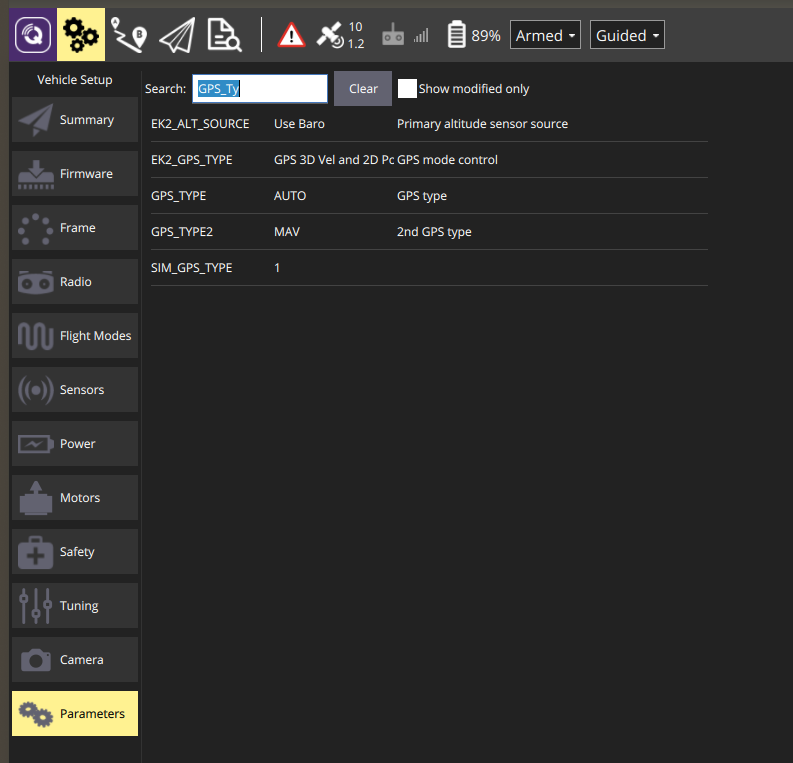
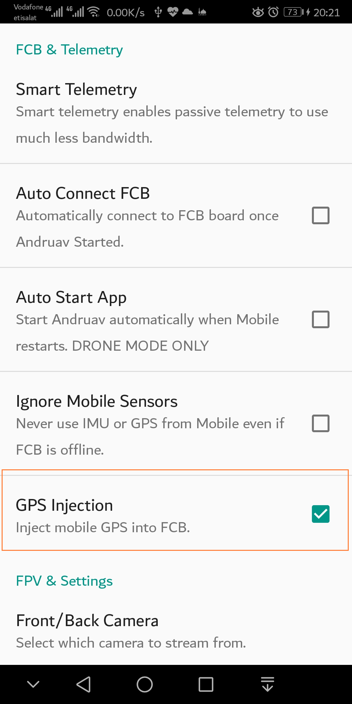

.. _andruav-gps-injection:

=====================
Andruav GPS Injection
=====================

Your drone-side phone already has a capable multi-constellation GNSS receiver.
With GPS Injection, Andruav sends the phone's GPS fix to the ArduPilot flight
controller over MAVLink (``GPS_INPUT``), so the flight controller can use the
phone **as its GPS** — either as its only GPS, or as a second GPS next to a real
receiver.

.. warning::

    A phone's GPS is usually less accurate than a dedicated GPS module — phones
    typically report 5–15 m horizontal accuracy even under open sky. Test on the
    ground (or in SITL) before you rely on it in flight, and keep a safe
    non-GPS flight mode ready.

Requirements
============

- The drone-side phone runs Andruav on **Android 8.0 (Oreo) or later** — the
  option is disabled on older Android versions.
- The phone has GNSS hardware and Andruav has **precise location** permission.
- Andruav is connected to an **ArduPilot** flight controller — see
  :ref:`andruav-getting-started`.
- The phone has a clear view of the sky. Indoors the phone usually has no GPS
  fix, and Andruav then sends nothing.

Step 1 — Configure the flight controller
========================================

Set the flight controller's GPS type to **MAVLink (14)** with Mission Planner or
QGroundControl, then **reboot** the flight controller.

.. list-table::
   :header-rows: 1
   :widths: 35 20 45

   * - Parameter
     - Value
     - Use
   * - ``GPS1_TYPE`` (ArduPilot 4.6+) or ``GPS_TYPE`` (older)
     - ``14``
     - The phone is the **primary** GPS.
   * - ``GPS2_TYPE`` (ArduPilot 4.6+) or ``GPS_TYPE2`` (older)
     - ``14``
     - The phone is a **second** GPS next to a real GPS receiver.

.. tip::

    Calibrate the compass **with the phone mounted** in its final position.
    A phone close to the compass disturbs it, and ArduPilot will then refuse to
    arm with ``PreArm: Check mag field``.

Step 2 — Enable GPS Injection in Andruav
========================================

On the drone-side phone open **Drone Settings → FCB & Telemetry** and enable
**GPS Injection**.

Once the flight controller is connected, the GPS Injection description shows
whether the flight controller will accept the phone's GPS:

- ``✓ Flight controller GPS1_TYPE is set to MAVLink (14)`` — ready.
- ``⚠ Flight controller is not set to receive it: GPS_TYPE=…, GPS_TYPE2=…`` —
  go back to Step 1; until the GPS type is 14 the injected GPS is ignored.

Related options in the same section:

- **Ignore Mobile Sensors** must be **off** — it switches the phone's GPS off, so
  the two options cannot be enabled together.
- **Inject Heading** also sends the phone's compass heading as the vehicle yaw.
  Leave it **off** unless the phone is rigidly fixed to the airframe with a known
  orientation — a loose or handheld phone feeds the flight controller a false
  heading.

Step 3 — Check that the flight controller uses the phone GPS
============================================================

Receiving the phone's GPS and *using* it are two different things. Watch the
flight controller messages in your ground station:

#. ``GPS 1: detected MAV`` — the flight controller receives Andruav's GPS.
#. ``EKF3 IMU0 is using GPS`` and ``EKF3 IMU0 origin set`` — the position
   estimator accepted it.
#. Home is set at the phone's location and position flight modes can arm.

ArduPilot's position estimator (EKF3) only accepts a GPS after **all** of these
checks pass continuously for **10 seconds**:

.. list-table::
   :header-rows: 1
   :widths: 40 30 30

   * - Check
     - Limit (default)
     - Mission Planner Status field
   * - Satellites used
     - 6 or more
     - ``satcount``
   * - HDOP
     - 2.5 or less
     - ``gpshdop``
   * - Horizontal accuracy
     - 5 m or less
     - ``gpsh_acc``
   * - Vertical accuracy
     - 7.5 m or less
     - ``gpsv_acc``
   * - Speed accuracy
     - 1.0 m/s or less
     - ``gpsvel_acc``

Until then the ground station shows ``PreArm: Need Position Estimate`` or
``PreArm: AHRS: waiting for home``.

When the phone's accuracy is not good enough
============================================

The most common blocker is **horizontal accuracy**. Phones often report about
10 m even next to a window with 40 satellites and an excellent HDOP, which is
above EKF3's 5 m limit — the flight controller then waits for home forever.
You have two options, both set on the flight controller:

- ``EK3_CHECK_SCALE = 200`` doubles the accuracy limits (horizontal 10 m).
- ``EK3_GPS_CHECK = 23`` disables only the position-accuracy check and keeps the
  satellite, HDOP, speed-accuracy and yaw checks (default is ``31``).

.. warning::

    Relaxing these checks means the vehicle navigates on a position estimate
    that may be off by 10 m or more. Use ``EK3_GPS_CHECK = 23`` for bench and
    SITL testing; on a real vehicle decide deliberately, and fly position modes
    with that error in mind.

How Andruav sends the GPS
=========================

- **10 times per second.** ArduPilot marks a GPS unhealthy below about 5 Hz,
  while a phone produces about one fix per second, so Andruav re-sends the
  latest fix at 10 Hz.
- **Real GPS fixes only.** Wi-Fi and cell-tower locations are never sent to the
  flight controller. The app's own map and server location still use them as
  before.
- **Stops on a lost fix.** If the phone has no new GPS fix for 2 seconds,
  Andruav stops sending; the flight controller reports the GPS lost after 4
  seconds.
- **Honest data.** Satellites *used in the fix*, the phone's reported accuracies,
  north/east velocity and altitude above mean sea level are sent. Values the
  phone does not report are marked as unavailable rather than sent as zero.
- **Heading only on request.** Yaw is sent only with **Inject Heading** enabled.

.. _andruav-gps-injection-sitl:

Testing GPS Injection with SITL
===============================

You can test the whole chain on a desk with ArduPilot SITL (see
:ref:`andruav-simulators`). Two things differ from a normal SITL session:

- SITL's own simulated GPS must be switched **off**, otherwise the test proves
  nothing.
- SITL must start **at the phone's location**. SITL simulates its compass for
  its own start location; if that is far from the phone, arming fails with
  ``PreArm: Check mag field``.

Create a parameter file ``andruav_gps_inject.parm``:

.. code-block:: text

    GPS1_TYPE        14
    GPS_TYPE         14
    SIM_GPS1_ENABLE  0
    SIM_GPS_DISABLE  1
    LOG_DISARMED     1
    EK3_GPS_CHECK    23

Both the old and the new parameter names are listed so the same file works with
older and newer ArduPilot versions. ``EK3_GPS_CHECK 23`` lets a desk test pass
with the phone's typical ~10 m accuracy.

Start SITL at the phone's latitude, longitude and altitude:

.. code-block:: bash

    cd ~/ardupilot
    build/sitl/bin/arducopter --model + --speedup 1 -I 0 \
        --home <phone_lat>,<phone_lng>,<altitude_msl>,0 \
        --serial1 udpclient:127.0.0.1:14550 \
        --defaults Tools/autotest/default_params/copter.parm,andruav_gps_inject.parm

SITL waits with ``Waiting for connection ....`` until a client connects on
**TCP port 5760**. In Andruav's FCB connection screen choose WiFi/TCP and connect
to ``<computer_ip>:5760``. A ground station can watch at the same time on UDP
port 14550.

.. note::

    Andruav does not reconnect automatically when SITL restarts — connect again
    from the FCB screen after every SITL restart.

Troubleshooting
===============

.. list-table::
   :header-rows: 1
   :widths: 35 35 30

   * - Message / symptom
     - Likely cause
     - What to do
   * - No GPS at all; settings show ``⚠ … GPS_TYPE=0``
     - Flight controller GPS type is not MAVLink
     - Set ``GPS1_TYPE`` (or ``GPS_TYPE``) to 14 and reboot
   * - No GPS at all; settings show ``✓``
     - The phone has no GPS fix (indoors)
     - Move the phone to open sky
   * - ``PreArm: GPS 1: not healthy``
     - GPS messages arrive too slowly or with gaps
     - Check the link between phone and flight controller
   * - ``GPS 1: Bad fix`` then ``GPS 1: detected MAV``
     - The GPS stream stopped for 4 seconds or more
     - Check the phone's GPS fix and the flight controller connection
   * - ``PreArm: Need Position Estimate`` or ``AHRS: waiting for home``
     - EKF3 GPS checks fail — usually horizontal accuracy above 5 m
     - Compare the Status fields with the table above; see
       *When the phone's accuracy is not good enough*
   * - ``PreArm: Check mag field (xy diff …)``
     - Compass disagrees with the field expected at the GPS location
     - Real vehicle: move the phone away from the compass and recalibrate;
       SITL: start SITL at the phone's location
   * - ``GPS Glitch or Compass error``
     - The GPS position jumped more than its reported accuracy
     - Improve the sky view and keep the phone firmly mounted
