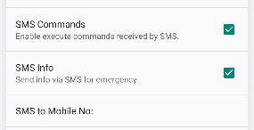

.. _andruav-sms:

===============================
Andruav SMS Reporting & Control
===============================

This feature utilizes the ability of mobile phone for sending andreceiving SMS and uses it to report drone status and location, and also for controling
drone.

This feature is very useful when conntection is very slow, or drone has been lost and you rely on your ohine to send SMS of its location.

How to Use
==========

#. Open PReference Screen.
#. Enable **SMS Commands** to enable controling drone using SMS.
#. Enable **SMS Info** to enable drone to report its location via SMS.
#. **SMS to Mobile No.** uses to report information when there is an emergency if **SMS Info** is enabled.

So if you enable **SMS Commands** you can send commands from any mobile. The mobile will also get location info if **SMS Info** is enabled.
A default mobile is used for eporting location when emergrncy.

SMS Commands
============

**ATT:RTL**
Activates RTL Mode.

**ATT:LAND**
Activates Land Mode.

**ATT:LOC**
Sends back location information from board or from mobile GPS.

