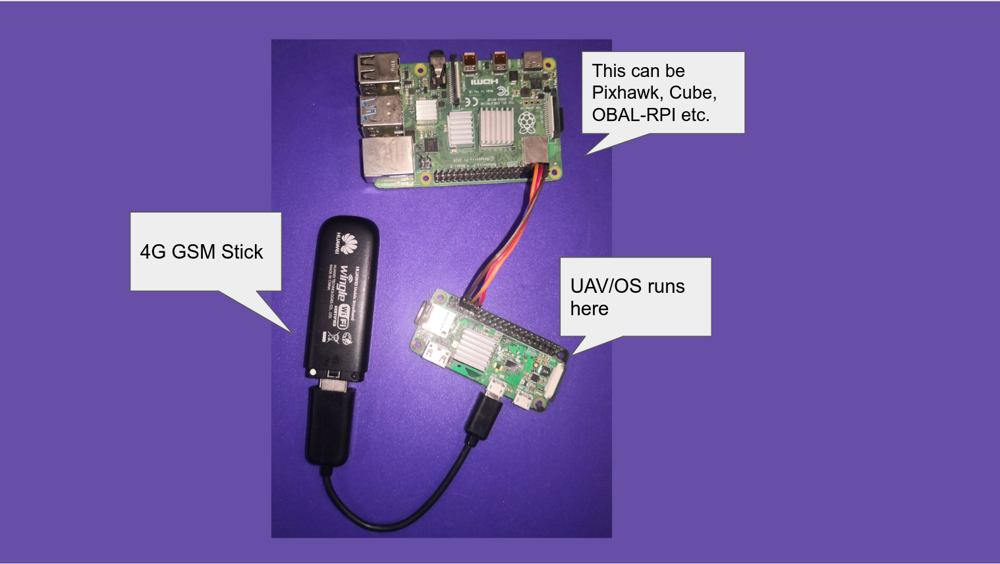

.. _de-advanced:

=================
Advanced Features
=================

|

DroneEngage offers powerful features beyond basic telemetry and video streaming. These advanced capabilities provide enhanced safety, control, and coordination for complex drone operations.

|

.. toctree::
   :caption: Safety & Control
   :titlesonly:
   :maxdepth: 1

   GEO-Fencing </de-geo-fencing>
   RC Blocking </de-tx-block>
   TX Freeze </de-tx-freeze>

.. toctree::
   :caption: Multi-Drone Operations
   :titlesonly:
   :maxdepth: 1

   Swarm Operations </de-swarm>

|

Feature Overview
================

**Safety Features**

- **GEO-Fencing** - Define safe flight zones and no-fly areas independent of the flight controller
- **RC Blocking** - Field pilot can instantly override all remote commands for emergency control
- **TX Freeze** - Lock throttle position for stable long-range flights

**Remote Control**

- **GamePad Navigation** - Fly your drone remotely using Xbox/PlayStation controllers via the web client

**Fleet Operations**

- **Swarm** - Coordinate multiple drones with hierarchical formations and synchronized missions
