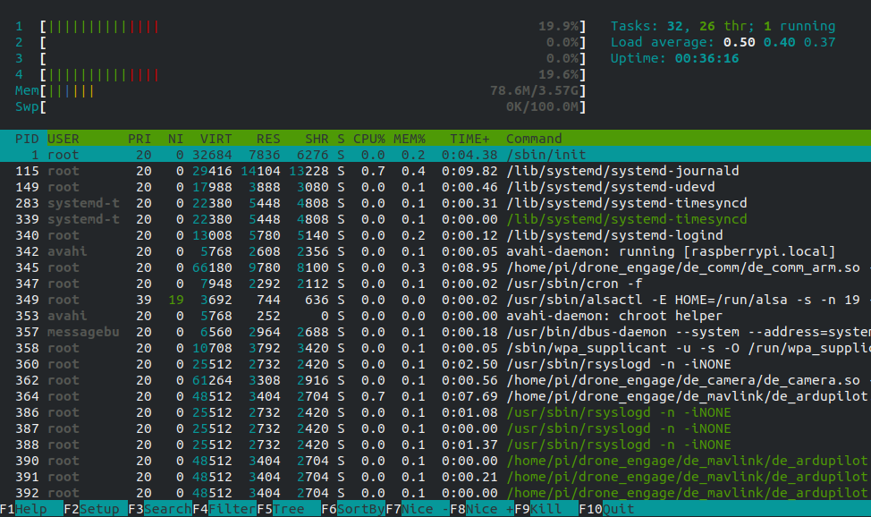

.. _de-all-in-one:

================
All In One Board
================

.. youtube:: https://www.youtube.com/watch?v=Rsuo76jYF0I

|

In this use case, we will combine the power of Drone-Engage with `OBAL Board <https://github.com/HefnySco/OBAL>`_ 
and use a single RPI-4 board to run both FCB & Companion Computer.

.. tip::

    Raspberry Pi-4 is all you need to have a drone that is you can control from Internet, stream video over GSM networks and access it from anyplace in the world.

|

Technical Points
================

Since `Ardupilot <https://ardupilot.org/>`_ is a realtime system and we are flyiing a quadcopter, so response time should be accurate and fast. The solution to this point was 
using `CPU affinity <https://github.com/ArduPilot/ardupilot/pull/18684>`_ . Since RPI-4 has 4 cores. we isolates two of them for running Ardupilot.
The remaining 2 cores are enough for running Drone-Engage pro version with Camera Module.

We can easily do that by editing /boot/cmdline.txt and add **isolcpus=1,2**

.. code-block:: bh

   console=tty1 root=PARTUUID=414e6dda-02 rootfstype=ext4 elevator=deadline fsck.repair=yes rootwait  isolcpus=1

As we can see from the above image that **htop** command shows core 1,2 with 0% utilization.

Then we can execute Ardupilot with the following parameters:

.. code-block:: bh
    
    /home/pi/arducopter -A  udp:192.168.1.144:14550:bcast  -C /dev/serial0 -c 1

In this case ardupilot will use core 1,2 only, and no other process will use share cores with it. This way helps to ensure stability.

