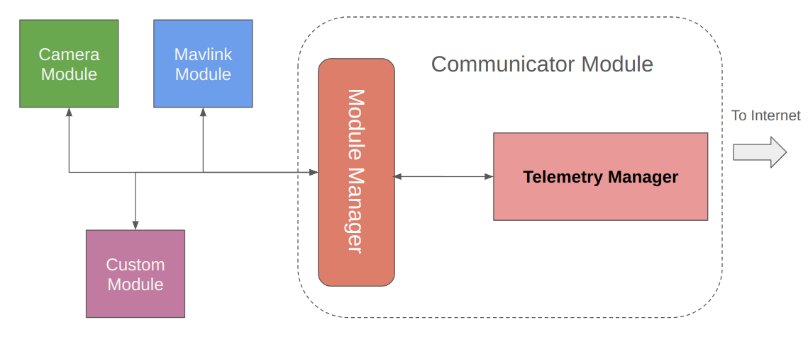

# DroneEngage DataBus

DroneEngage Databus is the protocol that is used to communicate between different modules in the unit.
The main component of DroneEngage for each unit is the Communicator module. The communicator module is the only module that can runs alone without
any other module. however it will not be useful, but it will appear on WebClient as a separate unit.





As we can see in the above diagram Communicator Module contains -among other components- Module Manager and Telemetry Manager.
<br>
<br>- **Telemetry Manager** is the component that is responsible for communicating with other modules, and [webclient-whatis](webclient-whatis.md) via [srv-communication](srv-communication.md). 
<br>- **Module Manager** is the component that is responsible for communicating with other modules of the same unit.
<br>- **Module Manager** is mainly a publisher subscriber module, where each module can subscribe in one or more messages listed in [de-dev-andruav-communication-protocol-messages](de-dev-andruav-communication-protocol-messages.md) 
using **message type**. 
<br>- **Module Manager** processes messages coming from Internet server via **Telemetry Manager** and then forward it
to modules subscribed in these messages.
<br> - It also does the opposite and forward messages from modules to Internet.
<br> - Modules intercommunication is also possible, for example communicator **mavlink** module determines location, which is used by **camera module** to label images with location before saving it.
<br> - Communication between modules in this part is implemented using UDP sockets, so it is very fast, also the inner layer handles data chunks so you 
can sends data of any size between modules without need to worry about how to slice or handle them.


## de_common Architecture

The `de_common` directory provides the core communication infrastructure for DroneEngage modules. It implements a robust UDP-based messaging system that enables reliable inter-module communication with automatic message chunking, reassembly, and module discovery.

### Directory Structure

The `de_common` directory is organized into two main components:

**de_databus/** - Core communication classes
    - `de_facade_base.hpp/cpp` - High-level API facade for module communication
    - `de_module.hpp/cpp` - Module management and routing functionality  
    - `udpClient.hpp/cpp` - UDP transport layer with chunking support
    - `de_message_parser_base.hpp/cpp` - Base class for message parsing
    - `de_common_callback.hpp` - Callback interface definitions
    - `messages.hpp` - Message type definitions and constants
    - `configFile.hpp/cpp` - Configuration file handling
    - `localConfigFile.hpp/cpp` - Local configuration management

**helpers/** - Utility classes and functions
    - `helpers.hpp/cpp` - General utility functions
    - `json_nlohmann.hpp` - JSON parsing library wrapper
    - `colors.hpp` - Console color utilities
    - `getopt_cpp.hpp/cpp` - Command line argument parsing
    - `util_rpi.hpp/cpp` - Raspberry Pi specific utilities

### Core Components

#### UDP Client (CUDPClient)

The UDP client provides the foundation for all inter-module communication:

**Key Features:**
- **Message Chunking**: Automatically splits large messages into configurable UDP chunks (default 8KB, max 64KB)
- **Automatic Reassembly**: Receives and reconstructs chunked messages in the correct order
- **Thread-Safe Operation**: Uses mutex protection for concurrent send/receive operations
- **Module Discovery**: Periodic broadcasting of module identification for network discovery
- **Callback Architecture**: Delivers reassembled messages through a clean callback interface

**Protocol Flow:**
1. **Initialization**: Creates UDP socket, binds to local port, starts receiver and ID broadcaster threads
2. **Message Sending**: Large messages are chunked with 2-byte headers (sequence number + end marker)
3. **Message Reception**: Receiver thread reassembles chunks and delivers complete messages via callback
4. **Module Discovery**: Periodic JSON ID broadcasting enables automatic module detection

#### Module Manager (CModule)

The module manager handles routing, registration, and message processing:

**Core Responsibilities:**
- **Module Definition**: Sets module class, ID, key, version, and message filters
- **Message Routing**: Handles inter-module, group, and individual message routing
- **JSON Message Construction**: Builds properly formatted messages with metadata
- **Registration Management**: Manages module identification and feature advertisement
- **Callback Chain**: Connects UDP transport to application-level message handlers

**Module Features:**
Modules can advertise capabilities using feature flags:
- `R` - Receiving telemetry
- `T` - Sending telemetry  
- `C` - Image capture
- `V` - Video capture
- `G` - GPIO control
- `A` - AI recognition
- `K` - Tracking
- `P` - Peer-to-peer communication

**Module Classes:**
Standard module types include:
- `comm` - Communication module
- `fcb` - Flight control board
- `camera` - Camera module
- `p2p` - Peer-to-peer module
- `gen` - Generic module
- `gpio` - GPIO module
- `ai_rec` - AI recognition module
- `trk` - Tracking module

#### Facade Base (CFacade_Base)

The facade provides a high-level API for application developers:

**Public API Methods:**
- `requestID()` - Request module identification from target party
- `sendErrorMessage()` - Send structured error messages
- `API_sendConfigTemplate()` - Send configuration templates to modules

**Design Pattern:**
- **Singleton Pattern**: Global instance accessible via `getInstance()`
- **Facade Pattern**: Simplifies complex subsystem interactions
- **Delegation**: Forwards operations to the underlying module singleton

### Message Flow Architecture

#### Outbound Message Flow (Application → Network)

1. **Application Layer**: Uses facade APIs (e.g., `requestID()`)
2. **Facade Layer**: Calls `m_module.sendJMSG()` on module singleton
3. **Module Layer**: Constructs JSON message with routing metadata
4. **Transport Layer**: UDP client chunks and transmits via UDP

#### Inbound Message Flow (Network → Application)

1. **Transport Layer**: UDP client receives and reassembles chunks
2. **Module Layer**: `onReceive()` parses JSON, validates routing, handles special messages
3. **Application Layer**: Registered callback receives parsed message
4. **Parser Layer**: Application parser processes message type and command

### Integration Example

Here's how a typical DroneEngage module integrates with `de_common`:

**Initialization:**
```cpp
// Define module characteristics
CModule::getInstance().defineModule(
    "camera",           // module class
    "CAM_MOD1",         // module ID  
    "cam-001-abc123",   // unique module key
    "v1.0.0",          // version
    message_filter     // JSON message filter
);

// Initialize communication
CModule::getInstance().init(
    "192.168.1.100",   // communicator IP
    6000,              // broadcast port
    "0.0.0.0",         // listen address
    6001,              // listen port
    8192               // chunk size
);

// Set message receive callback
CModule::getInstance().setMessageOnReceive(onMessageReceived);
```

**Sending Messages:**
```cpp
// Use high-level facade API
CFacade_Base::getInstance().requestID("target-module-id");

// Or use direct module API
Json_de message = {
    {"command", "capture_image"},
    {"params", {{"quality", 90}}}
};
CModule::getInstance().sendJMSG("target-module-id", message, TYPE_AndruavMessage_RemoteExecute, false);
```

**Receiving Messages:**
```cpp
void onMessageReceived(const char* raw_data, int len, Json_de json_msg) {
    // Parse and handle incoming message
    std::string message_type = json_msg["1"];
    if (message_type == TYPE_AndruavMessage_RemoteExecute) {
        // Handle remote command execution
        parseRemoteCommand(json_msg);
    }
}
```

### Configuration and Deployment

**Configuration Files:**
- `configFile` handles global configuration settings
- `localConfigFile` manages module-specific local settings
- JSON-based configuration for easy modification

**Build Integration:**
- Header-only design for easy inclusion
- Minimal external dependencies (only standard library and JSON parser)
- Cross-platform compatibility (Linux, Windows, embedded systems)

**Thread Safety:**
- All public APIs are thread-safe
- Mutex protection for shared resources
- Separate threads for receiving and ID broadcasting

### Performance Characteristics

**Throughput:**
- UDP-based transport for low latency
- Configurable chunk sizes optimize for network conditions
- Zero-copy message passing where possible

**Reliability:**
- Automatic message reassembly handles packet loss
- Sequence numbers ensure proper chunk ordering
- End-of-message markers detect complete transmissions

**Scalability:**
- Singleton design minimizes memory footprint
- Efficient JSON parsing with nlohmann/json
- Threaded architecture handles concurrent operations

This architecture provides a robust foundation for building scalable DroneEngage modules that can communicate reliably over various network conditions while maintaining clean separation between transport, routing, and application logic.
