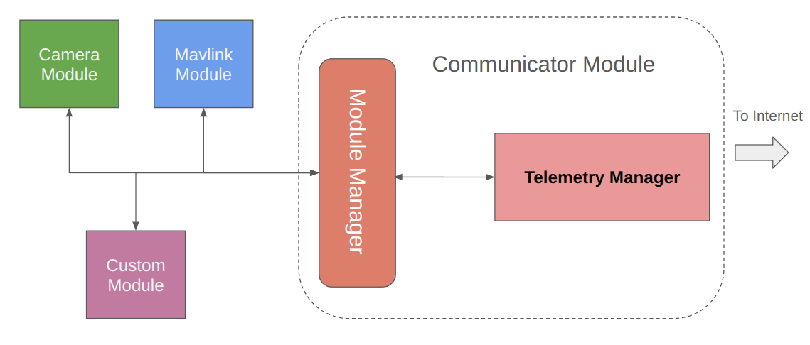

.. _de-dev-databus:

===================
DroneEngage DataBus
===================

DroneEngage Databus is the protocol that is used to communicate between different modules in the unit.
The main component of DroneEngage for each unit is the Communicator module. The communicator module is the only module that can runs alone without
any other module. however it will not be useful, but it will appear on WebClient as a separate unit.

|

As we can see in the above diagram Communicator Module contains -among other components- Module Manager and Telemetry Manager.
|br|
|br|- **Telemetry Manager** is the component that is responsible for communicating with other modules, and :ref:`webclient-whatis` via :ref:`srv-communication`. 
|br|- **Module Manager** is the component that is responsible for communicating with other modules of the same unit.
|br|- **Module Manager** is mainly a publisher subscriber module, where each module can subscribe in one or more messages listed in :ref:`de-dev-andruav-communication-protocol-messages` 
using **message type**. 
|br|- **Module Manager** processes messages coming from Internet server via **Telemetry Manager** and then forward it
to modules subscribed in these messages.
|br| - It also does the opposite and forward messages from modules to Internet.
|br| - Modules intercommunication is also possible, for example communicator **mavlink** module determines location, which is used by **camera module** to label images with location before saving it.
|br| - Communication between modules in this part is implemented using UDP sockets, so it is very fast, also the inner layer handles data chunks so you 
can sends data of any size between modules without need to worry about how to slice or handle them.

