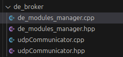
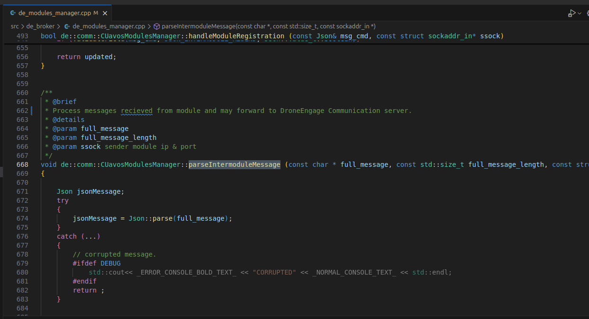

.. _de-dev-plugin:

=========================
DroneEngage Custom Plugin
=========================

Writing a Custom Plugin allows you to write a module that can handle hardware part such as GPIO or sensors ...etc. 
or writing a module that performs data processing, such as processing images from the camera module for example.
Once you write this module and integrate it to the system using `Databus library <https://github.com/DroneEngage/droneengage_databus>`_ 
you will be able to access that new module from even remote units, and :ref:`de-web-client`.

|

--------
The Code
--------

There are two parts of the code you need to understand if you want to make a custom plugin.

-----------
Broker Code
-----------
The **broker code**, which is part of the Communicator Module, and this part you do not need to go deeply into it unless you need to 
make a complex plugin.

**Source Code:** `https://github.com/DroneEngage/droneengage_communication/tree/master/src/de_broker <https://github.com/DroneEngage/droneengage_communication/tree/master/src/de_broker>`_  

|

|

|

------------------------
Drone Engage Plugin Code
------------------------

This is actually the part of code that you will include into your plugin. Your plugin can be written in C++, nodejs, Python, or any other language,
however the available plugin templates are in C++, nodejs and Python.

**Source Code:** `https://github.com/DroneEngage/droneengage_databus <https://github.com/DroneEngage/droneengage_databus>`_  

|

