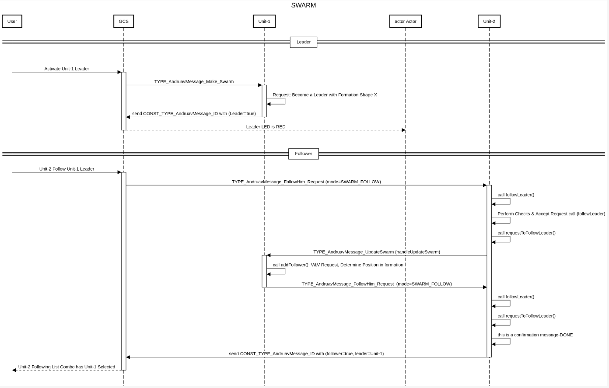

.. _de-dev-swarm:

=================
DroneEngage SWARM
=================

The DroneEngage SWARM system is designed to facilitate the coordination and management of drone formations. Each swarm comprises a single leader drone and multiple follower drones, enabling efficient operation in various scenarios.

.. image:: ./images/swarm_formation_1.png
   :align: center
   :alt: SWARM Formation Hierarchy

The following diagram shows the main logic of SWARMS in DroneEngage.

Features
========

- **SWARM Composition**: Each swarm consists of one leader drone and multiple follower drones.

- **Formation Management**: Each swarm maintains a specific formation, with each follower assigned a unique position referred to as its index.

- **Hierarchical Structure**: Follower drones can assume the role of leaders within their own sub-SWARMS, creating a hierarchical organization. This allows for complex operational strategies where each follower can have its own set of followers.

- **Independent Operation**: Grandchildren followers operate independently from their grandparent leader. This allows for flexibility and autonomy during missions.

- **Dynamic Formation**: The swarm formation can be adjusted dynamically during execution, enabling real-time adaptations to changing circumstances.

Formation Types
===============

The DroneEngage SWARM supports the following formation patterns:

- **No Swarm** (0): Default state, no active formation

- **Thread Formation** (1): Followers follow in a line behind the leader, maintaining a rope-like distance effect based on their index position

- **Arrow Formation** (2): Followers form a V-shaped pattern behind the leader, alternating left and right sides

- **Vector Formation** (3): Formation based on vector direction (requires angle parameter)

Technical Architecture
======================

The swarm system is implemented using three main C++ classes:

**CSwarmManager**
  - Central manager handling leader/follower relationships
  - Manages swarm state and formation configuration
  - Handles message routing between leader and followers
  - Maintains lists of follower units with their indices

**CSwarmLeader**
  - Leader-specific logic for sending updates to followers
  - Broadcasts position and attitude data to followers
  - Implements formation-specific update logic
  - Runs at 1Hz update rate (configurable)

**CSwarmFollower**
  - Follower-specific logic for receiving leader data
  - Calculates target positions based on formation type and index
  - Processes MAVLink messages from leader
  - Implements rope-effect for thread formation and V-pattern for arrow formation

Distance Parameters
===================

The swarm system uses configurable distance parameters:

- **KNODE_LENGTH**: Default distance unit (100m)
- **Min Horizontal Distance**: Minimum horizontal spacing between drones (default: 100m)
- **Min Vertical Distance**: Minimum vertical spacing between drones (default: 100m)

These parameters can be configured via message commands (h: horizontal, v: vertical) when making a swarm or joining as a follower.

Unit Roles
==========

Unit-1 is a DroneEngage unit that should be a leader of the swarm. Unit-2 is a DroneEngage unit that should be a follower of the swarm.

Transition to Leader
--------------------

The process for establishing Unit-1 as the leader is as follows:

 - User clicks on SWARM Leader button to make Unit-1 a leader of the swarm.
 - WebClient Sends AndruavMessage_Make_Swarm Message to Unit-1.
 - Unit-1 receives the message and starts the SWARM Leader mode.
 - Unit-1 sends an updated AndruavMessage_ID to confirm that it is a leader.

Transition to Follower
----------------------

The process for establishing Unit-2 as a follower is as follows:

 - The user selects Unit-1 as the leader for Unit-2.
 - The WebClient sends an AndruavMessage_Join_Swarm message to Unit-2.
 - Unit-2 receives the message and performs necessary validations, including disassociating from any previous leader, before sending a request to Unit-1 to join the SWARM.
 - Unit-1 receives the request and determines the appropriate location (index) for Unit-2 within the current swarm configuration.
 - Unit-1 responds to Unit-2 with the relevant configuration details (formation shape and location within the formation).
 - Unit-2 receives the configuration reply and, if accepted, sends a confirmation back to Unit-1.
 - Unit-2 then sends an updated AndruavMessage_ID to confirm its status as a follower.
