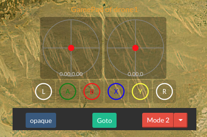

.. _de-gamepad:

========================
Navigation Using GamePad
========================

.. youtube:: -qh248Hnn-M

|

:ref:`de-web-client` allows you to connect XBOX-360 gamepad directly to your webbrowser. 
You do not need to run GCS applications such as `Mission Planner <https://ardupilot.org/planner/>`_ to connect your joystick anymore.

|

Features
========

1. Gamepad can control one vehicle at a time. And you can switch control between multiple vehicles.
2. Channel reverse and scale is set by editing **config.module.json** file. This is a very important feature, as if you are going to use GamePad for different drones and vehicle you will need to reverse some channels and change rate of some channels based one the vehicle your control. This is handled automatically by storing RX settings in each ArdupilotModule configuration file.

.. code-block:: JAVASCRIPT

   "rc_channels":
   {
      "rc_channel_enabled": [1, 1, 1, 1, 1, 1, 1, 1, 1, 1, 1, 1, 1, 1, 1, 1, 1, 1],
      "rc_channel_reverse": [1, 1, 1, 1, 1, 1, 1, 1, 1, 1, 1, 1, 1, 1, 1, 1, 1, 1],
      "rc_channel_limits_max": [1850,2000,1750,2000,2000,2000,2000,2000,2000,2000,2000,2000,2000,2000,2000,2000,2000,2000],
      "rc_channel_limits_min": [1150,1000,1300,1000,1000,1000,1000,1000,1000,1000,1000,1000,1000,1000,1000,1000,1000,1000]
   }
   
.. note::

    Although xml does not allow adding comments in c-style using "//" but **config.module.json** accepts this syntax.

3. You can change flight modes from GamePad buttons by long pressing "red - yellow - blue - green" buttons.

+------------+------------+-----------+
| VEHICLE    | COLOR      | MODE      |
+------------+------------+-----------+
| Copter     | blue       | Guided    |
+------------+------------+-----------+
| Copter     | green      | Land      |
+------------+------------+-----------+
| Copter     | red        | Break     |
+------------+------------+-----------+
| Copter     | yellow     | RTL       |
+------------+------------+-----------+

|

4. You need to use a wired XBOX Gamepad not the wireless one. Other Gamepads can work, however you need to make sure channels are mapped correctly. 

.. image:: ./images/xbox-wired.png
   :align: center
   :alt: XBox Wired Gamepad

.. note::

    Connecting joystick to Mission Planner and control your drone via :ref:`webclient-web-plugin` is possible but not recommended as this method is more efficient.

|

Running in Linux
================

For Windows you can just plug you xbox-360 gamepad directly and it will be detected by Windows with no extra settings. In linux you need to run a simple script before the browser is able to detect gamepad.

You need to create .sh file and run it.

.. code-block:: bash

    #!/bin/bash
    sudo killall xboxdrv
    sudo xboxdrv --detach-kernel-driver

|

Taking & Releasing Control
==========================

To activate control to GamePad press **RX** button for the vehicle you want to control. **RX** button should be **RX-ON**.

.. image:: ./images/menu_rx_off.png
   :align: center
   :alt: Take Remote

To release control press the same button **RX** or press **TX-Rel** button. **RX** button should be **RX-Off**.

.. image:: ./images/menu_rx_on.png
   :align: center
   :alt: Release Remote

|

Automatic Channel Mapping
=========================

Different veichles can have different channels for Roll-Pitch-Throttle-Yaw. If you want Drone-Engage to remap channels instead of using default first 4 channels blindly then you need 
to define **"rc_smart_channels"** record. In this record you can override **"rc_channel_enabled"**, **"rc_channel_limits_max"** and **"rc_channel_limits_min"** for the 4 main channels.
The order is always fixed in the config file **ROLL - PITCH - THR - YAW** regardless of actual channel numbers.

|

In the video I use `OBAL <https://ardupilot.org/copter/docs/common-obal-overview.html>`_ board and I use diffrent channels and still I can control the wheels without adjusting channel nummber.

.. youtube:: MeYIKJpHngM

|

To enable this feature you need to edit **config.module.json** file and add the following.

.. code-block:: JAVASCRIPT

   "rc_channels":
   {
      // SMART MAPPING BEGIN
      "rc_smart_channels": // optional but very recommended.
      { 
         "active": true, // optional and true by default as record "rc_smart_channels" already exists.
         
         // ROLL - PITCH - THR - YAW regardless of actual settings on ardupilot 
         "rc_channel_enabled": [1, 1, 1, 1], // optional - enabled by default.
         "rc_channel_limits_max": [2000,2000,1750,2000], // optional if not exist then global rc_channel_limits_max are used
         "rc_channel_limits_min": [1000,1000,1300,1000]  // optional if not exist then global rc_channel_limits_min are used
      },
      // SMART MAPPING END

      "rc_channel_enabled": [1, 1, 1, 1, 1, 1, 1, 1, 1, 1, 1, 1, 1, 1, 1, 1, 1, 1],
      "rc_channel_reverse": [1, 1, 1, 1, 1, 1, 1, 1, 1, 1, 1, 1, 1, 1, 1, 1, 1, 1],
      "rc_channel_limits_max": [1850,2000,1750,2000,2000,2000,2000,2000,2000,2000,2000,2000,2000,2000,2000,2000,2000,2000],
      "rc_channel_limits_min": [1150,1000,1300,1000,1000,1000,1000,1000,1000,1000,1000,1000,1000,1000,1000,1000,1000,1000]
   }
   
|

DJI-Style Remote
================

`DJI  <https://www.dji.com/phantom>`_ is known of its ease of flying among many other features. What is targetted here is that changing throttle stick function so that pushing stick up will lead to climbing while pusshing it down will lead to decreasing altitude. Andruav make use on Ardupilot remote control features to achieve similar capabilities.

This mode is activated automatically from :ref:`de-web-client` when switching to **Guided Mode** in copter vehicle. It is equivelant to fly-by-wire in ArduPlane.

|

.. tip::
   You can use :ref:`de-simulators` for safely testing this feature.

   
