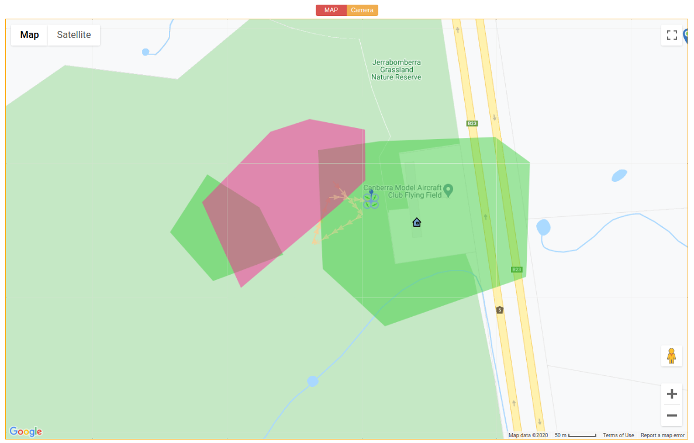
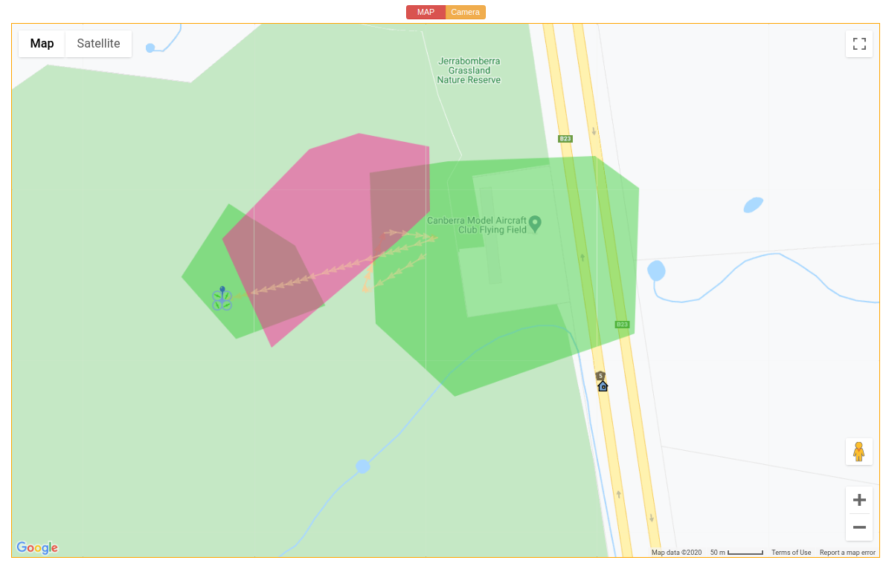
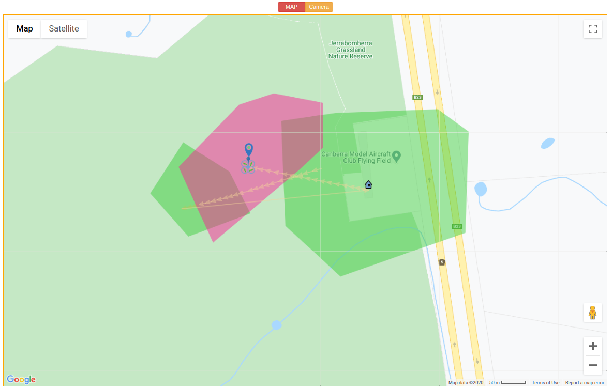

.. _de-geo-fencing:

=======================
DroneEngage Geo Fencing
=======================

Geo Fence means that you define areas where you that is safe for your drone to fly in and other areas that is unsafe or forbidden to fly over them.

This is not GEO fence that Ardupilot support. This Geo-Fencing is controlled by DroneEngage itself not ardupilot. It is very flexible.

.. youtube:: URw6F2fcFS4

|

To access Geo-Fence click `https://droneengage.com:8021/mapeditor.html <https://droneengage.com:8021/mapeditor.html>`_ .

Geo-Fence Manager allows you to design geo-fences and mission plans for multiple drones at the same time. You can even design missions that 
**interacts** with each others as in the below video. This is **unique**.

.. youtube:: YwEw_YSFVEo

|

In the below image you can see *two* mission plans together with geo-fences regions. There is a green Geo-Fence region but inside it a no fly zone in red. Another no-fly zone exists outside the green area. 

.. image:: ./images/_new_map4.png
        :align: center
        :alt: Mission Planner

you can export each mission plan as a file to be uploaded from :ref:`de-web-client`. Geo-Fences on the other side are saves for all the group in the system database.
Geo-Fences will be active each time DroneEngage Mobile starts until it is deleted by `Geo-Fence editor <https://droneengage.com:8021/mapeditor.html>`_ .

Rules of Geo-Fence
==================
#. If there is only red *no-fly* zones. then you can fly any where except these areas.
#. If there is one or more *green-fly* zone you need to fly into one of these areas.
#. A red area can be inside a green area. You always need to be in the green but not in the red.

|

**The following are good fence example:**

|

**The following are bad fence example:**

.. image:: ./images/bad_fence2.png
   :height: 400px
   :alt: Bad fence example 2

Also this is a bad situation as green areas are defined and drone is out of it.

.. image:: ./images/bad_fence1.png
   :height: 400px
   :alt: Bad fence example 1

