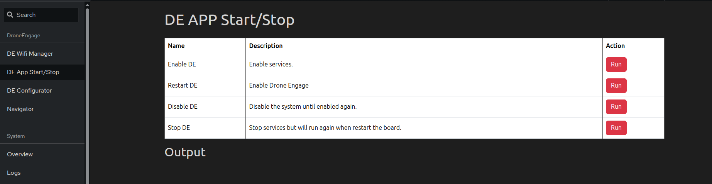

.. _de-rpi-image-tools-bash:

=============================================
Drone Engage RPI Image Tools - APP Start/Stop
=============================================

|

This tool is used to easily start and stop the DroneEngage binaries running on the RPI image.

This tools calls scripts stored in the RPI image at /home/pi/scripts .
so if you are interested to know the details or modify the behavior you can edit these bash scripts.

**Enable DE**
This script enables DE binaries to start on boot.

**Restart DE**
This script restarts the DE binaries.

**Disable DE**
This script disables DE binaries to start on boot.

**Stop DE**
This script stops the DE binaries, but it will restart on the next boot.