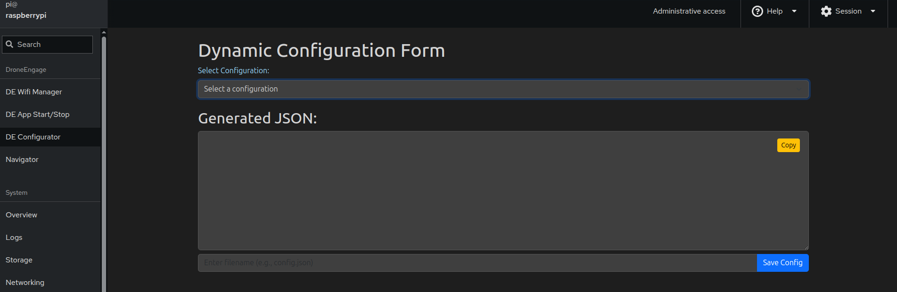
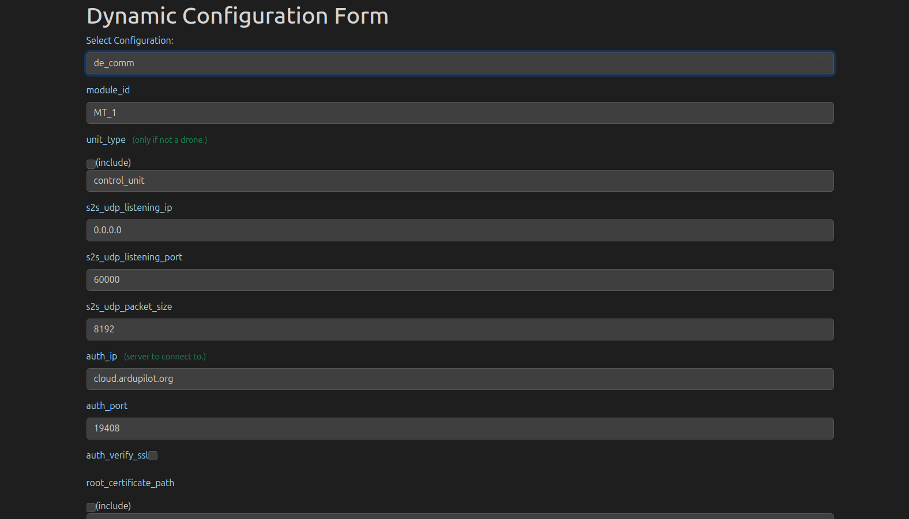

.. _de-rpi-image-tools-configurator:

===========================================
Drone Engage RPI Image Tools - Configurator
===========================================

|

This tool helps users to configure JSON configuration files for DroneEngage modules.

you can select the file and related fields will appear in the forms below and based on your selection configuration file is generated.

.. note::
   This tools generates the setting file test, but does not edit it.
   You can use the Navigator/Terminal to edit the file.

    
    

