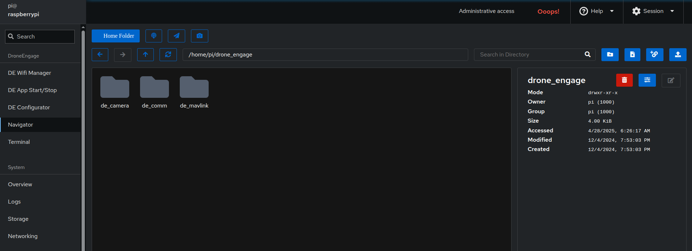
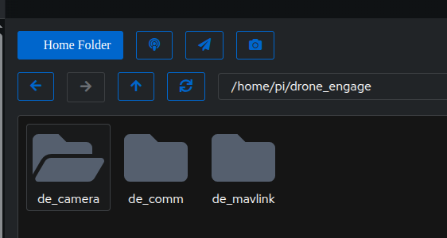

.. _de-rpi-image-tools-navigator:

========================================
Drone Engage RPI Image Tools - Navigator
========================================

|
    
This tool helps in managing RPI images effectively, providing options for image creation, restoration, and management.
It allows you to create, restore, and manage files easily.

The following buttons on the navigator helps you to navigate to module locations.
This helps you to easily access configuration files and other files related to the modules such as images in the camera module.

|

|

