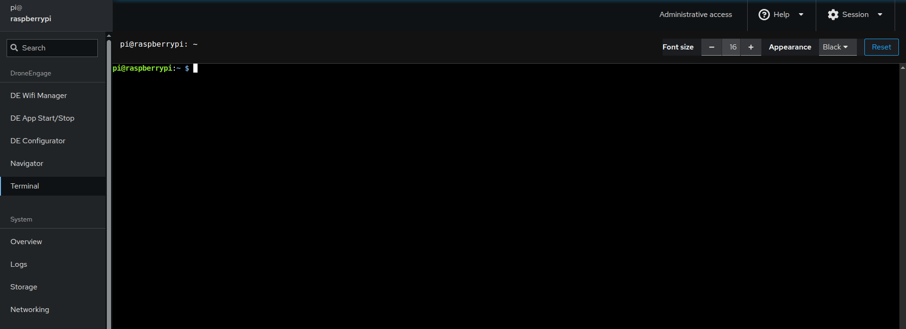

.. _de-rpi-image-tools-terminal:

=======================================
Drone Engage RPI Image Tools - Terminal
=======================================

|

This is a web ssh terminal for the RPI image. It is targeted for advanced users who are familiar with the command line interface.

Samples of commands that can be used in the terminal are:
---------------------------------------------------------

**DE home directory**
.. code-block:: bash
    
    $ ls ~/drone_engage

**Manually start Communication Module**
.. code-block:: bash 
    
    $ cd  ~/drone_engage/de_comm

    $ sudo de_comm.so

**Manually start Camera Module**
.. code-block:: bash 
    
    $ cd  ~/drone_engage/de_camera

    $ sudo de_camera64.so