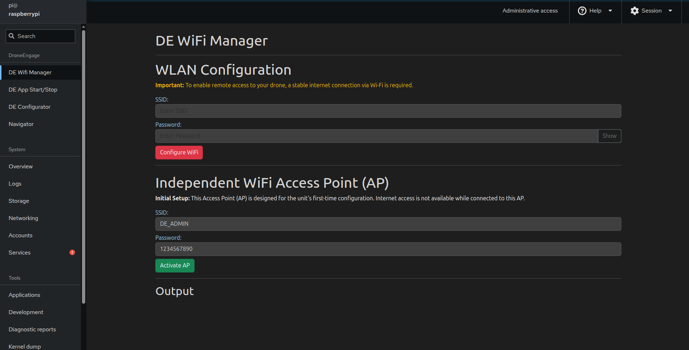

.. _de-rpi-image-tools-wifi:

===========================================
Drone Engage RPI Image Tools - WIFI Manager
===========================================

|

This tool helps you connect your Raspberry Pi to your home Wi-Fi network (or any other Wi-Fi network). It also gives you the option to turn your Raspberry Pi into a temporary Wi-Fi hotspot.

First-Time Setup: Connecting via the 'DE_ADMIN' Wi-Fi
-----------------------------------------------------

When you first install and run the Raspberry Pi image, it will automatically create a temporary Wi-Fi network named DE_ADMIN with the password droneengage.

Here's how to connect using this temporary network:

On your laptop or another device, open your Wi-Fi settings. 
Look for and connect to the network named **DE_ADMIN**. 
When prompted, enter the password: **droneengage**. 
Once connected, open a web browser and go to the address: https://192.189.9.1:9090. 
This will open the Raspberry Pi image tools in your browser. 
Connecting to Your Home Wi-Fi
Within the Raspberry Pi image tools (accessed via the steps above), you'll find an option to connect your Raspberry Pi to your home Wi-Fi network. Simply select your network name (SSID) from the available list and enter your Wi-Fi password.

Switching Back to Hotspot Mode (If Needed)
------------------------------------------

If you ever need to, you can switch your Raspberry Pi back into a Wi-Fi hotspot. This option will also be available within the Raspberry Pi image tools.

.. note:: 
    **Important**: For DroneEngage to function correctly, your Raspberry Pi needs to be connected to either a Wi-Fi network or a GSM network. It cannot operate while in the temporary DE_ADMIN hotspot mode.

    
    

