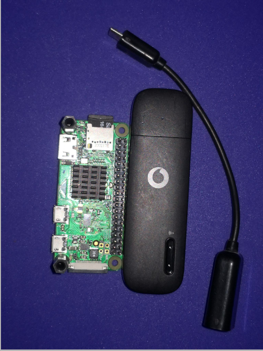
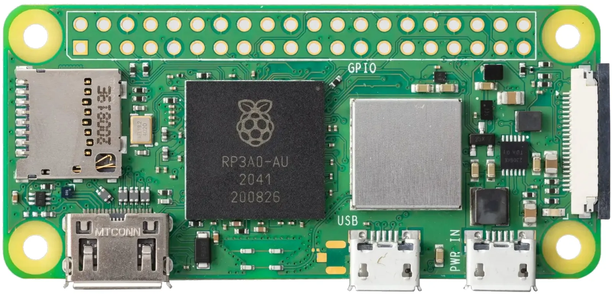
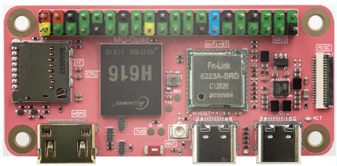

.. _de-select-hardware:

====================
Select Your Hardware
====================

A Raspberry Pi board with internet connectivity is required.  Supported models include the Raspberry Pi 2, 3, 4, and Zero/Zero 2.  The chosen model influences system capabilities.  The Raspberry Pi 4 is recommended for applications requiring multi-camera video streaming, enabling simultaneous streaming from multiple connected cameras.

For telemetry-only applications, the Raspberry Pi Zero is a suitable choice.

Internet connectivity can be established via a USB 4G/LTE data stick or a HAT incorporating a 4G, LTE, or 5G modem.

The `Raspberry-PI Zero 2 W  <https://www.raspberrypi.com/products/raspberry-pi-zero-2-w/>`_ , released in late 2021, offers a quad-core processor and a five-fold performance increase compared to the Raspberry Pi Zero W.  This model is ideal for single-camera FPV applications, offering a balance of performance, power efficiency, and weight.  For multi-camera setups and future expansion with more complex modules, the Raspberry Pi 4 remains the recommended option.

The `Mangopi MQ-Quad MCore H616   <https://mangopi.org/h616/>`_  (https://mangopi.org/h616/) presents a competitive alternative to the Raspberry Pi Zero 2 W, offering comparable performance at a potentially lower cost and improved availability.

.. warning::
    The `Mango MQ-Quad MCore H618 <https://forum.mangopi.org/t/new-user-help-needed/2140/8>`_ is not supported due to the absence of a Linux image.  Ensure the H616 (https://mangopi.org/h616/) model is selected.

.. tip::
    For optimal performance, it is recommended to use the Raspberry Pi Zero for telemetry-only functions, and the Raspberry Pi Zero 2 W or Raspberry Pi 4 for combined telemetry and video streaming.