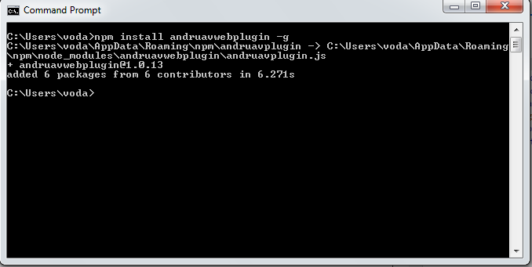
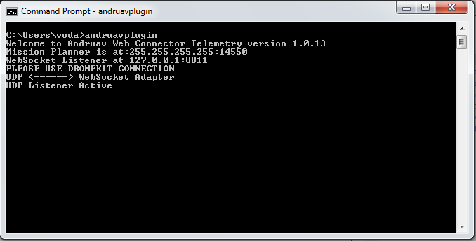

.. _de-web-plugin:

==================
Mavlink Web Plugin
==================

Web Plugin streams telemetry data from :ref:`de-web-client` to GCS apps such as Mission Planner, QGround Control or similar GCS applications to your vehicle via :term:`Andruav`.

You can connect directly from :ref:`de-web-client`. This plugin can run on Windows, MacOS & Linux.

.. youtube:: https://www.youtube.com/watch?v=mUCbhzvmVcI

|

Steps Description
=================

1. Install `nodejs <https://nodejs.org/en/download/>`_ on your machine, it works on Linux, Windows & Mac.

2. Install `mavlinkwebplugin App <https://www.npmjs.com/package/mavlinkwebplugin>`_ from command prompt using command.

.. code-block:: bash

    $npm install mavlinkwebplugin -g

|pic1|  and   |pic2|

|

3. Run **mavlinkwebplugin** from command prompt. You don't need to change any ports. For more options you can run:

.. code-block:: bash

    $ mavlinkwebplugin -h

    
 

4. Open `Drone-Engage Web Client <https://droneengage.com:8021/webclient.html>`_ and press **Tele-Off** it should turn into red and be Tele-On

.. image:: ./images/web_telemetry_on.png
    :align: center
    :alt: Web Telemetry

5. Open `Mission Planner <https://ardupilot.org/planner/>`_ or `QGroundControl <http://qgroundcontrol.com/>`_ and connect using UDP default port 14550.

.. image:: ./images/connectUDP.png
    :align: center
    :alt: Web Telemetry

.. important::

    Drone-Engage Web Plugin uses UDP connection. You need to be careful when you select the connection in your GCS App such as `Mission Planner <https://ardupilot.org/planner/>`_ and `QGroundControl <http://qgroundcontrol.com/>`_.

