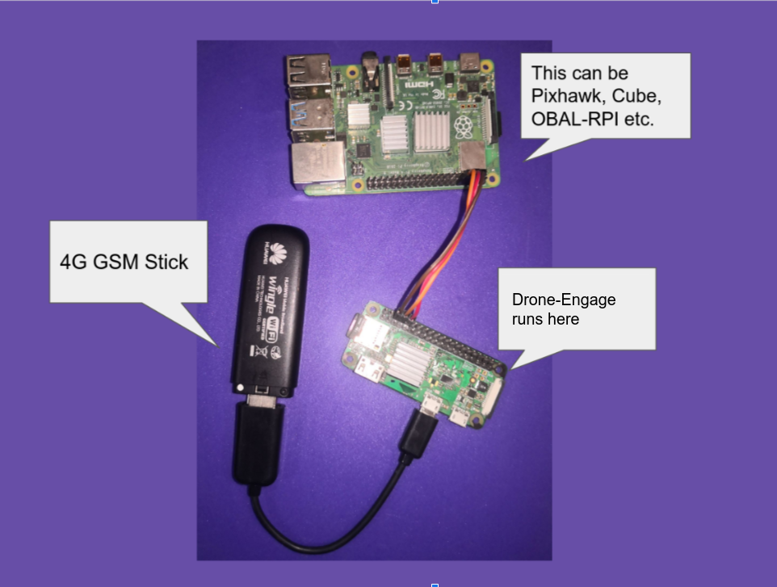
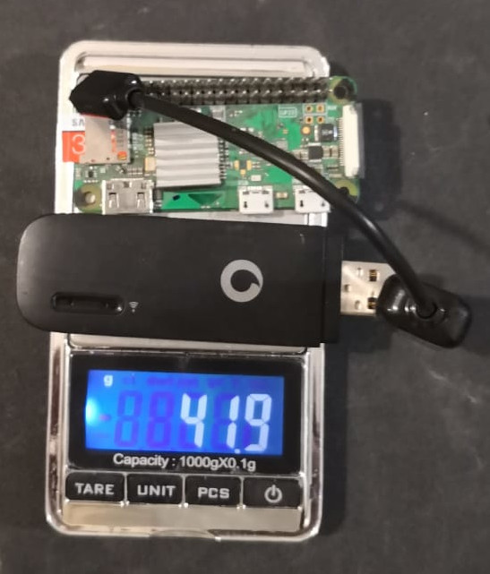
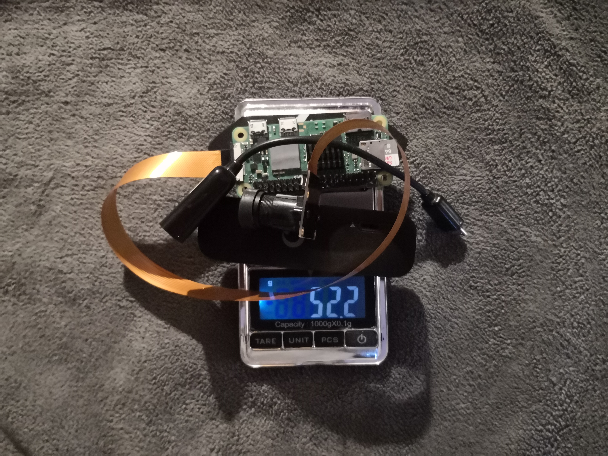

.. _what-is-drone-engage:

======================
What is Drone-Engage ?
======================

Drone-Engage (D.E.) is a distibuted system that allows monitoring & controlling drones via Internet. Drone-Engage objective is to provide a Linux-based alternative for `Andruav <https://play.google.com/store/apps/details?id=arudpilot.andruav&hl=en&gl=US>`_ Android mobiles.

.. youtube:: F9b4dXLRLjg

|
Now you can use Raspberry-pi boards to run Drone-Engage companion computer software and enjoy tiny size of RPI-Zero, and the multi-camera capabilities or RPI-4.
|

|
.. tip::

      Download Drone-Engage apps from `here <https://drive.google.com/drive/folders/1wMIw5VSW4CdIxMXIFMeq0AyuZBDIfFaH?usp=sharing>`_

Drone-Engage uses on-board Raspberry-Pi Zero connected to `Ardupilot <https://ardupilot.org/>`_ flight control board "FCB" to provide unlimited range telemetry and control. 

It is only 42 grams or 1.48 oz is everything you need to take full control on your drone anywhere anytime.

If you want to make use of video streaming then you can use Raspberry-Pi Zero 2. It is only 52.2gm or 1.84oz.
including camera and OTG cable.

