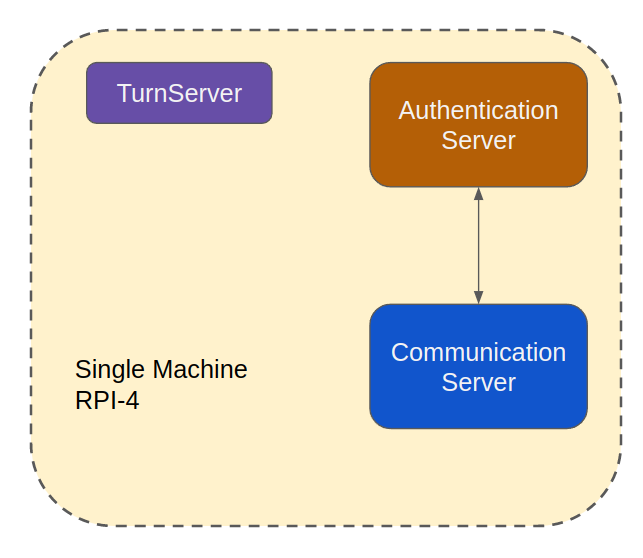

.. _srv-Installation:

============================
Backend-Servers Installation
============================

|

There are multiple configurations for Backend-Server. As Backend-Servers support load balancing and failures. 
The simplest way to deploy Backend-Server on a small computer that can be as simple as `Raspberry PI-4 <https://www.raspberrypi.com/>`_.

.. toctree::
   :caption: Contents:
   :titlesonly:
   :maxdepth: 2

   Air-Gap Tiny Server Installation </srv-install-airgap>

