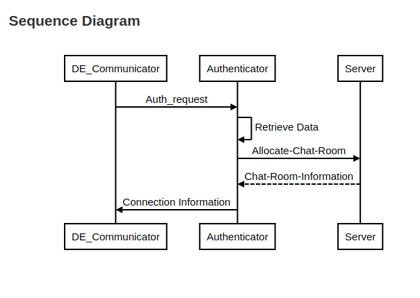

.. _srv-communication:

====================
Communication Server
====================

The **Communication Server** is the real-time messaging backbone of DroneEngage. It relays WebSocket messages between drone units and Ground Control Stations, and it can form a server-to-server mesh for scalable deployments.

|

What It Does
============

- Accepts persistent WebSocket connections from drone units and GCS clients.
- Routes messages by group or individual target.
- Provides server-to-server (S2S) relay for multi-region or redundant setups.
- Offers a UDP proxy for MAVLink and other UDP protocols.
- Persists tasks and, optionally, message history via MySQL.

The communication server maintains a persistent WebSocket connection to the authenticator. When a drone or web client authenticates, the authenticator requests the communication server to generate a temporary login key. The client then uses this key to establish a WebSocket connection to the communication server.

Deployment Modes
================

- **Standalone** — single server for local or small deployments.
- **Child server** — connects to a parent server for relay.
- **Parent (super) server** — accepts child connections and forwards messages across the mesh.

|

Source Code: `https://github.com/DroneEngage/droneengage_communication <https://github.com/DroneEngage/droneengage_communication>`_

:ref:`webclient-udp-telemetry` is part of the communication server.

|

Settings
========

Settings is defined in a file called **server.config** the most important fields are:
    |br| **server_id**: Defines name of the communication server.
    |br| **server_ip**: Defines ip that is the server is listening to. default: "::"
    |br| **public_host**: This is the ip or domain name of the server from the view points of DroneEngage units and webclient.
    |br| **server_sid**: A fixed unique number given to the server, as the system allows multiple communication servers to run together.
    |br| **server_port**: Defines the port that is the server is listening to. default:9966
    |br| **enable_SSL**: Sometimes you want to skip the SSL connection validation, due to constraints in your network.
    |br| **s2s_ws_target_ip**: This is the ip of :ref:`srv-authentication`. This is a websocket connection between :ref:`srv-authentication` and :ref:`srv-communication`.
    |br| **s2s_ws_target_port**: This is the port for the same websocket connection between :ref:`srv-authentication` and :ref:`srv-communication`.

|

.. code-block:: json

    {
        "server_id"                     : "DE_Lap",
        "server_ip"                     : "::",
        "public_host"                   : "airgap.droneengage.com",
        "server_sid"                    : 0,
        "server_port"                   : 9966,
        "enable_SSL"                    : true,
        "s2s_ws_target_ip"              : "127.0.0.1",
        "s2s_ws_target_port"            : "19408",
        "ssl_key_file"                  : "./ssl/privkey.pem",
        "ssl_cert_file"                 : "./ssl/fullchain.pem",     
        "allow_fake_SSL"                : true,                                                                                       
        "ca_cert_path"                  :"/home/pi/ssl/root.crt",
        "ignoreLoadingTasks"            : true,
        "command_plugin"                : "./js_andruav_command_processing",
        
        "allow_udpproxy_fixed_port"     : true,
        
        "ignoreLog"                 : true,
        "log_directory"             : "./logs/",
        "log_timeZone"              : "GMT",
        "log_detailed"              : true

    }

|

.. warning::
    Although above is a JSON file but you can add comments to the code using ``//`` and ``/* */`` blocks.

|

For Developers
==============

- **Runtime**: Node.js 18+.
- **Stack**: Express, ``ws``, MySQL2, Ed25519 S2S auth.
- **Key files**:
  - ``server.js`` — main entry point.
  - ``server/js_andruav_comm_server.js`` — WebSocket server.
  - ``server/chat_server/js_chat_routing.js`` — message routing.
  - ``server/server_to_server/js_s2s_auth.js`` — Ed25519 S2S authentication.
- **Configuration**: ``server.config`` (JSON, supports ``--config`` override).

See :doc:`Server Technicals <technicals/server/de-server-technicals>` for routing, S2S relay, and configuration details.

