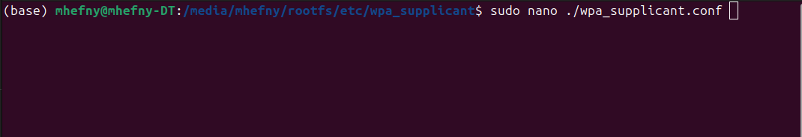
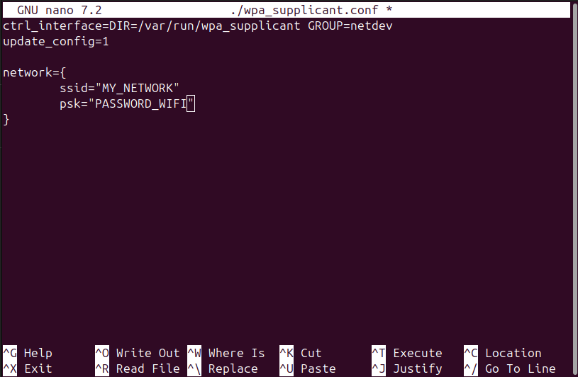

.. _srv-install-airgap-download:

=========================
Air-Gap RPI-4 Ready Image
=========================

You can download a ready-made image from here:

Download Image from `Here <https://cloud.ardupilot.org/downloads/RPI_Full_Images/>`_ .

Please remember to change the password to your own WIFI password by editing /etc/wpa_supplicant/wpa_supplicant.conf
as in the below images.

change SSID and password to your own WIFI and password by editing it on your laptop before running the ROM on the RPI.

