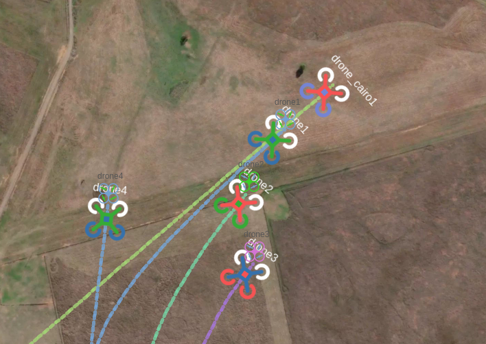
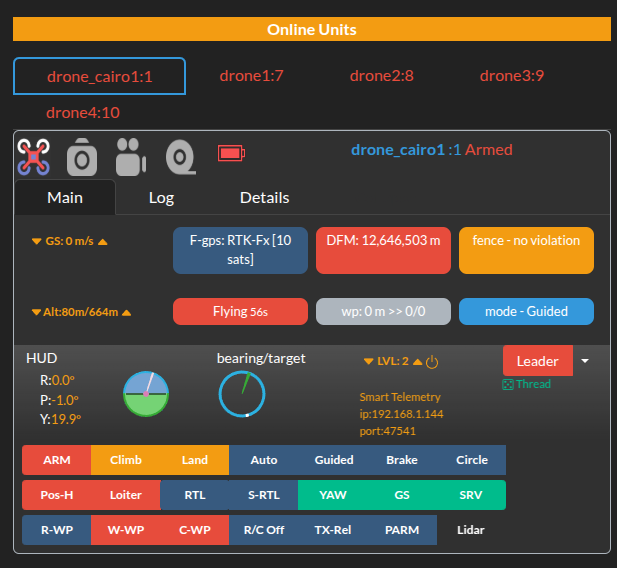
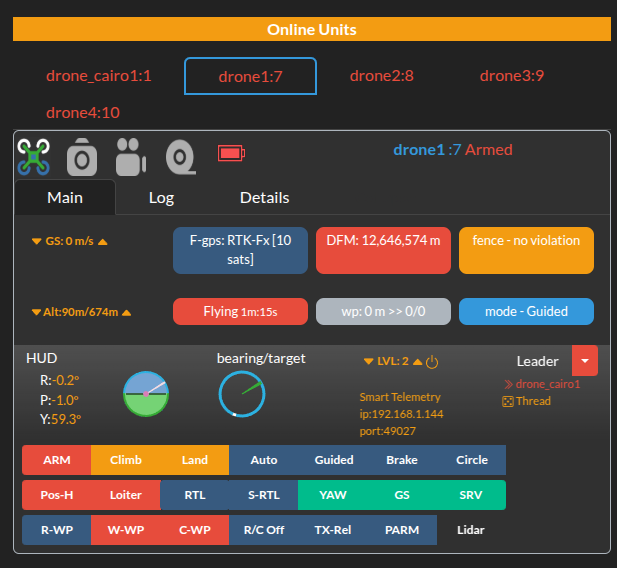
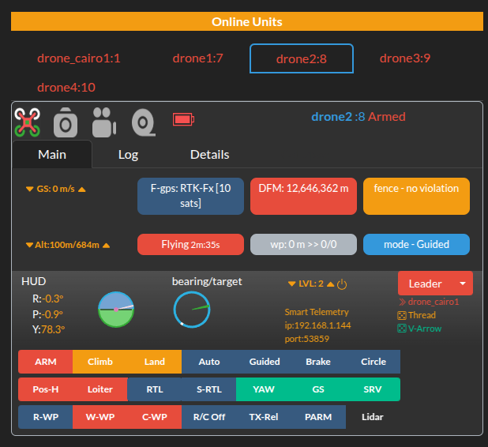

.. _webclient-swarm:

===============
SWARM Interface
===============

|

|

The DroneEngage SWARM system is designed to facilitate the coordination and management of drone formations. Each swarm comprises a single leader drone and multiple follower drones, enabling efficient operation in various scenarios.

|

.. image:: ./images/swarm_formation_1.png
   :height: 400px
   :align: center
   :alt: FPV Vertical & Horizontal

|

Features
--------

-   **SWARM Composition**: Each swarm consists of one leader drone and multiple follower drones.
    
-   **Formation Management**: Each swarm maintains a specific formation, with each follower assigned a unique position referred to as its index.
    
-   **Hierarchical Structure**: Follower drones can assume the role of leaders within their own sub-SWARMs, creating a hierarchical organization. This allows for complex operational strategies where each follower can have its own set of followers.
    
-   **Independent Operation**: Grandchildren followers operate independently from their grandparent leader. This allows for flexibility and autonomy during missions.
    
-   **Dynamic Formation**: The swarm formation can be adjusted dynamically during execution, enabling real-time adaptations to changing circumstances.
    

|

You can control each drone in the swarm using the SWARM interface in the WebClient. The following diagram illustrates the main logic of SWARMS in DroneEngage.

The following image shows drone_cairo as a Leader and its formation is Thread.
Formation of drone_cairo appears in greed. you can click on it and change it in realtime.

|

|

The following image shows drone1 as a follower of drone_cairo. 
Formation of drone_cairo appears in yellow.

|

|

The following image shows drone2 as a follower of drone_cairo. 
drone2 is also a leader at the same time it is a leader.
Formation of drone_cairo appears in yellow.
Formation of drone2 appears in green and you can change it in real time.

|

|

To control SWARM in drones, followers drone need to be in GUIDED mode.
That means the leader can be in Auto mode executing an Ardupilot-mission.
Followers can temporary stop being in SWAM by activating break mode.

