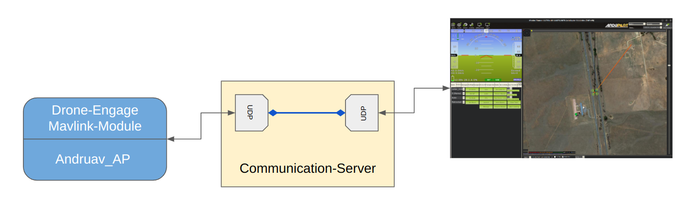
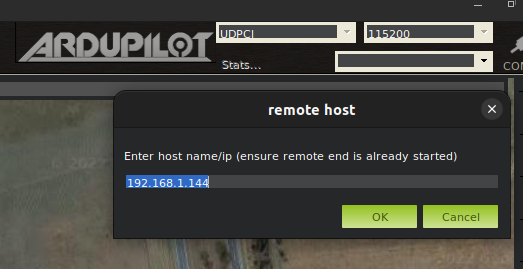
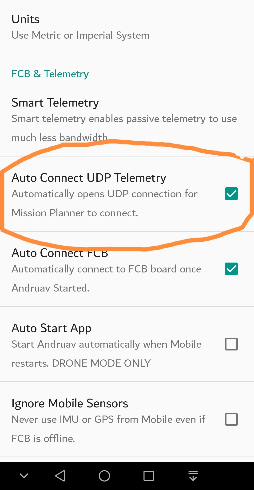

.. _webclient-udp-telemetry:

==================
Web UDP Telemetry
==================

|pic1|

|

This is not a module that you need to install like :ref:`webclient-web-plugin`. This is a built-in feature in Andruav_AP & DroneEngage as well. 
The :ref:`srv-communication` creates two sockets, with one socket receiving telemetry data streamed from the drone via UDP, and the other socket allowing the user to connect using UDPCI in Mission Planner or other GCS software.

You can adjust the telemetry rate on the web client by using the "LVL" feature, which can be helpful if you have a low bandwidth connection. See below.

|

.. youtube:: C_AcmUGXFVQ

|

As demonstrated in the video, the usage of this feature is straightforward. Simply access the WebClient to obtain the UDP configuration settings, and then connect to the feature using UDPCI in Mission Planner.

|pic3|  and   |pic4|

.. |pic3| image:: ./images/webclient_udp_proxy.png
   :width: 35 %
   :alt: udp IP & Port

|
   The **LVL** section in the WebClient allows for control over the rate of telemetry messages, with level 0 indicating full rate and level 3 indicating the lowest rate. 
   The UDP Proxy can be paused or resumed by clicking the power button, which will turn gray when paused and resume using the same port when restarted. 
   In DroneEngage, the :ref:`de-config-mavlink` allows for detailed control over these rates.

In the JSON configuration file, each message type is configured with maximum rates for streaming. 
For instance, message id 24 (GPS_RAW_INT) will have zero delay at level 0, an 800ms minimum delay at level 1, a 1-second minimum delay at level 2, and a 2-second minimum delay at level 3. 
Other messages not mentioned will have zero delay for all levels, and messages with zero delay will be sent as quickly as they are generated by the autopilot.

Customization of these rates may be necessary based on specific needs, but typically selecting the LVL that corresponds to the speed of your internet connection will suffice.

.. code-block:: json

   {
    "message_timeouts":
    { 
         "1": [0,250,500,1000],
         "2": [0,250,500,1000],        // SYSTEM_TIME
        "24": [0,800,1000,2000],       // GPS_RAW_INT
        "27": [0,500,1000,2000],       // RAW_IMU
        "28": [0,500,1000,2000],       // RAW_PRESSURE
        "29": [0,250,1000,2000],       // SCALED_PRESSURE
        "30": [0,250,1000,2000],       // ATTITUDE
        "32": [0,250,1000,2000],       // LOCAL_POSITION_NED
        "33": [0,250,1000,2000],       // GLOBAL_POSITION_INT
        "34": [0,500,1000,2000],       // RC_CHANNELS_SCALED
        "35": [0,500,1000,2000],       // RC_CHANNELS_RAW
        "36": [0,1000,2000,2000],      // SERVO_OUTPUT_RAW
        "42": [0,1000,2000,4000],      // MISSION_CURRENT
        "62": [0,250,500,1000],        // NAV_CONTROLLER_OUTPUT
        "65": [0,500,1000,2000],       // RC_CHANNELS
        "74": [0,500,1000,2000],       // VFR_HUD 
        "87": [0,500,1000,1000],       // POSITION_TARGET_GLOBAL_INT
        "116": [0,1000,2000,4000],     // SCALED_IMU2
        "124": [0,800,1000,2000],      // GPS2_RAW
        "125": [0,1000,2000,4000],     // POWER STATUS
        "129": [0,1000,2000,4000],     // SCALED_IMU3
        "136": [0,250,500,1000],       // TERRAIN_REPORT
        "137": [0,250,1000,2000],      // SCALED_PRESSURE2
        "143": [0,250,1000,2000],      // SCALED_PRESSURE3
        "147": [0,250,2000,4000],      // BATTERY_STATUS
        "152": [0,4000,8000,12000],    // MEMINO
        "163": [0,250,500,1000],       // AHRS
        "165": [0,250,1000,2000],      // HWSTATUS
        "178": [0,250,500,1000],       // AHRS2
        "182": [0,250,500,1000],       // AHRS3
        "193": [0,250,500,1000],       // EKF_STATUS_REPORT
        "241": [0,250,1000,2000],      // VIBRATION 
        "234": [0,250,1000,2000],      // HIGH_LATENCY 
        "235": [0,250,1000,2000],      // HIGH_LATENCY2 
        "11030": [0,1000,2000,5000],   // ESC_TELEMETRY_1_TO_4
        "11031": [0,1000,2000,5000],   // ESC_TELEMETRY_5_TO_8
        "11032": [0,1000,2000,5000]    // ESC_TELEMETRY_9_TO_12
        
    },
  }

|
This feature can be enabled in Andruav using the settings.

|pic5|

To enable udp_proxy in DroneEngage, modify the **udp_proxy_enabled** property in the *config.module.json** file of :ref:`de-config-mavlink`. 
The UDP port number for a unit remains fixed as long as the Communication-Server is operational and has not been restarted. 
If necessary, you can specify a fixed port number using the **udp_proxy_fixed_port** property, 
but the Communication-Server may override this and allocate a different port based on its own configuration settings.

.. code-block:: json

   {
   "udp_proxy_enabled": true,
   "udp_proxy_fixed_port":15412,
   }

